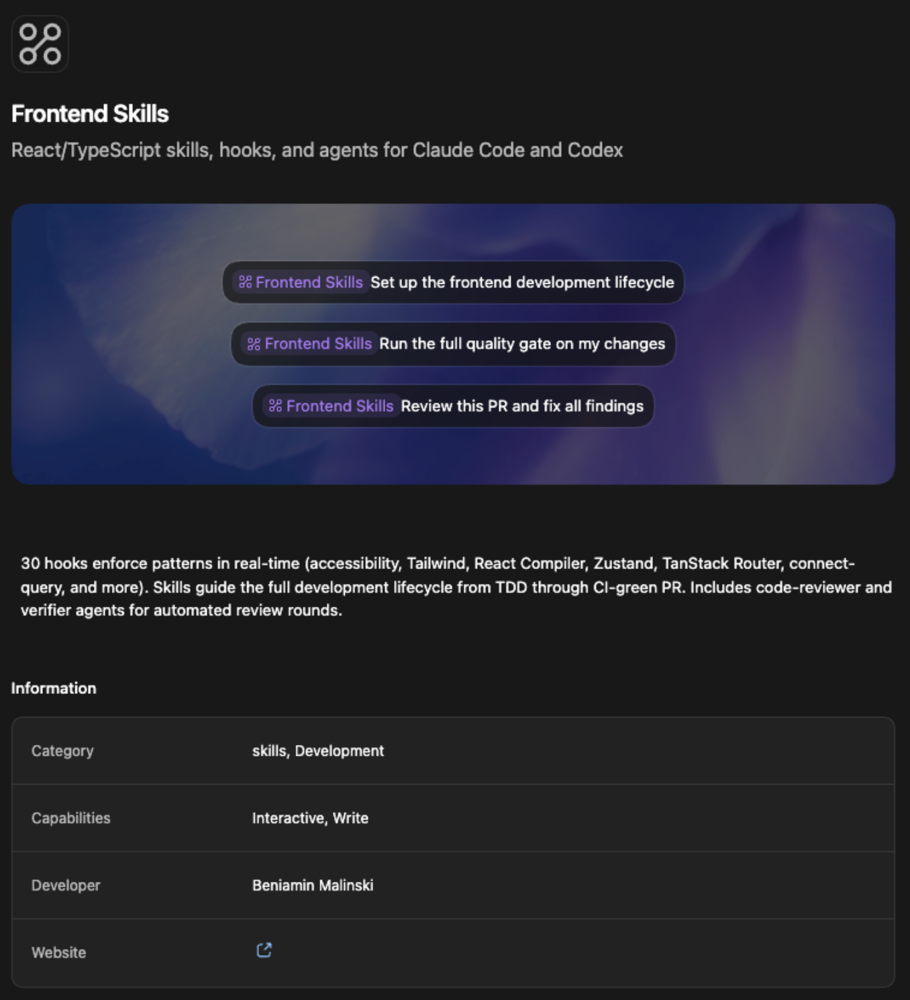
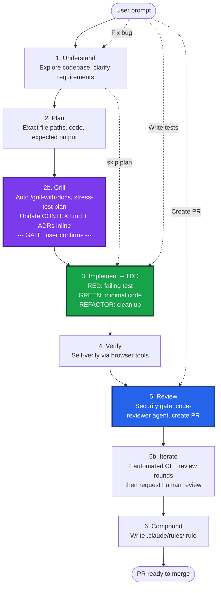
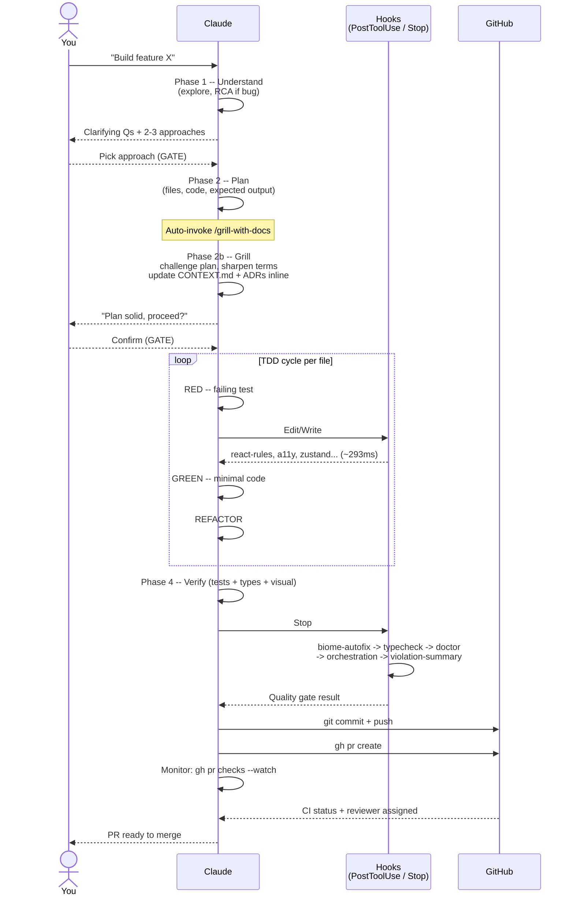
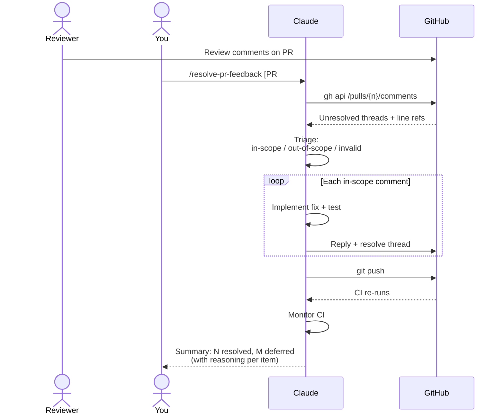
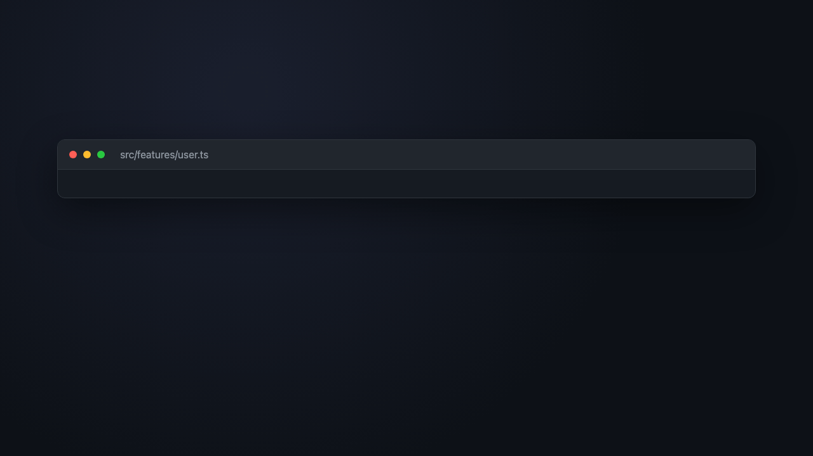
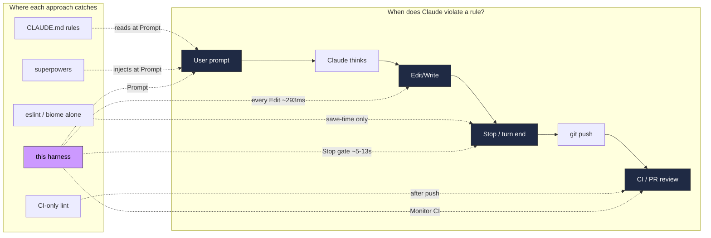
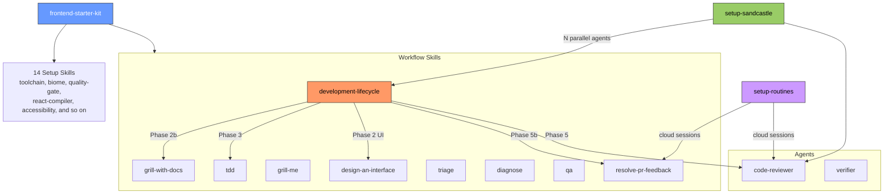
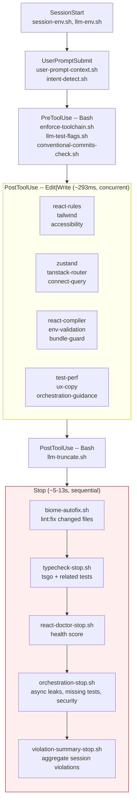

# Agent Skills

**Tell Claude what build. Get PR ready merge.**

Hooks enforce patterns real-time, skills guide workflow, orchestration layer ensure nothing ships without tests, accessibility, type safety, code review -- zero babysit.

<p align="center">
  
</p>

## Install

Run inside [Claude Code](https://docs.anthropic.com/en/docs/claude-code) session (start with `claude` in terminal):

```bash
/plugin marketplace add redpanda-data/ui-harness
```
```bash
/plugin install frontend-skills@ui-harness
```
```bash
/reload-plugins
```

Three commands. Skills, hooks, agents activate immediately. Done.

**Recommended: rtk** (output-compression proxy, ~60-90% token savings on git/cargo/test/gh):

```bash
brew install rtk
rtk trust            # approve .rtk/filters.toml per project
```

Harness fail-open -- skip safe; SessionStart nudge remind if miss.

**Update** (pull latest):

```bash
/plugin install frontend-skills --force
```

Restart Claude Code session so hooks reload from new cache.

**Verify:**

```bash
bash "$(ls -d ~/.claude/plugins/cache/ui-harness/frontend-skills/*/ | tail -1)scripts/verify-install.sh"
```

<details>
<summary>Codex (OpenAI) -- install as Codex plugin</summary>

Repo ships a Codex-native plugin manifest (`.codex-plugin/plugin.json`) and marketplace (`.agents/plugins/marketplace.json`). Use the Codex marketplace CLI when you want Codex to install and track the marketplace source instead of editing `config.toml` by hand.

**1. Upgrade Codex and enable plugins/hooks**

```bash
brew upgrade --cask codex
codex features enable plugins
codex features enable codex_hooks
```

**2. Add this marketplace from the CLI**

Track latest `main`:

```bash
codex plugin marketplace add redpanda-data/ui-harness --ref main
codex plugin marketplace upgrade ui-harness
codex plugin add frontend-skills@ui-harness
```

Or pin a release:

```bash
codex plugin marketplace add redpanda-data/ui-harness --ref v4.10.2
codex plugin marketplace upgrade ui-harness
codex plugin add frontend-skills@ui-harness
```

**General CLI forms**

```bash
codex plugin marketplace add owner/repo
codex plugin marketplace add owner/repo --ref main
codex plugin marketplace add https://github.com/example/plugins.git --sparse .agents/plugins
codex plugin marketplace add ./local-marketplace-root
```

Marketplace sources can be GitHub shorthand (`owner/repo` or `owner/repo@ref`), HTTP or HTTPS Git URLs, SSH Git URLs, or local marketplace root directories. Use `--ref` to pin a Git ref, and repeat `--sparse PATH` to use a sparse checkout for Git-backed marketplace repos. `--sparse` is valid only for Git marketplace sources.

Do not use `--sparse .agents/plugins` for this repo as-is: the marketplace entry points `frontend-skills` through `./plugins/frontend-skills`, a symlink back to the repo root, so Codex needs the root plugin files too.

**Refresh or remove configured marketplaces**

```bash
codex plugin marketplace upgrade
codex plugin marketplace upgrade marketplace-name
codex plugin marketplace remove marketplace-name
```

For this repo specifically:

```bash
codex plugin marketplace upgrade ui-harness
codex plugin marketplace remove ui-harness
```

After adding or upgrading, restart Codex so the Plugins UI reloads metadata.

</details>

<details>
<summary>Alternative: install individual skills via skills.sh (granular control)</summary>

Use if want specific skills instead of full plugin.

```bash
# Core workflow + all setup skills
bunx skills@latest add redpanda-data/ui-harness/frontend-starter-kit --agent claude-code -y

# Just the development lifecycle (no setup hooks)
bunx skills@latest add redpanda-data/ui-harness/development-lifecycle --agent claude-code -y

# Project management + planning skills
bunx skills@latest add redpanda-data/ui-harness/work-automation-kit --agent claude-code -y

# Individual skills -- pick what you need:
bunx skills@latest add redpanda-data/ui-harness/brainstorming --agent claude-code -y
bunx skills@latest add redpanda-data/ui-harness/tdd --agent claude-code -y
bunx skills@latest add mattpocock/skills/grill-with-docs --agent claude-code -y
bunx skills@latest add redpanda-data/ui-harness/grill-me --agent claude-code -y
bunx skills@latest add redpanda-data/ui-harness/triage --agent claude-code -y
bunx skills@latest add redpanda-data/ui-harness/diagnose --agent claude-code -y
bunx skills@latest add redpanda-data/ui-harness/qa --agent claude-code -y
bunx skills@latest add redpanda-data/ui-harness/zoom-out --agent claude-code -y
bunx skills@latest add redpanda-data/ui-harness/design-an-interface --agent claude-code -y
bunx skills@latest add redpanda-data/ui-harness/improve-codebase-architecture --agent claude-code -y
bunx skills@latest add redpanda-data/ui-harness/request-refactor-plan --agent claude-code -y
bunx skills@latest add redpanda-data/ui-harness/write-a-skill --agent claude-code -y
bunx skills@latest add redpanda-data/ui-harness/codex-compat --agent claude-code -y
```

**Optional extras:**

```bash
# TanStack official reference skills (28 soft-guidance skills from docs)
npx @tanstack/intent@latest install

# Atlassian/Jira integration (requires acli installed)
bunx skills@latest add redpanda-data/ui-harness/setup-atlassian-workflow --agent claude-code -y

# Redpanda-specific (Chakra/legacy bans, registry workflow)
bunx skills@latest add redpanda-data/ui-harness/redpanda-frontend-kit --agent claude-code -y
```

**Verify:** `bash scripts/verify-install.sh`

</details>

## How It All Connects

```
You: "Build feature X" or "Fix these 5 issues overnight"
  │
  ├── Interactive ──-> Claude Code + /development-lifecycle
  │                    └── understand -> plan -> TDD -> verify -> review -> compound
  │
  ├── AFK batch ───-> Sandcastle (.sandcastle/main.ts)
  │                    └── picks issues -> spawns N agents in Docker
  │                        └── each agent runs development-lifecycle
  │
  └── Automated ───-> Routines (claude.ai/code/routines)
                      └── schedule, GitHub webhook, or API trigger
                          └── cloud session with hooks + CLAUDE.md active
                              └── PR review, triage, health checks, docs drift
```

### Development Lifecycle

6-phase workflow drive every task, feature to fix. Phases skippable by task type -- bug fix jump straight to TDD, test request go direct Phase 3.



<details>
<summary>Sequence diagram -- full lifecycle (who does what, when)</summary>

Shows timing of user input, Claude phases, hook enforcement, and PR handoff. Two user gates: approve approach (after Plan) and approve plan (after Grill). Everything else automatic.



</details>

<details>
<summary>Sequence diagram -- PR review resolution loop (/resolve-pr-feedback)</summary>

How Claude handles human review feedback without you babysitting each thread.



</details>

**Try it yourself** -- copy-paste into a Claude Code session:

<details>
<summary>Real starter prompts (pick one)</summary>

**Feature work:**
```
/development-lifecycle -- add dark mode toggle to settings page.
Read src/routes/settings.tsx first. Propose approach, wait for my approval.
```

**Bug fix (skip plan phase):**
```
/development-lifecycle -- users report form submits twice on double-click.
Reproduce, find root cause, fix with test.
/visual-review -- review changed frontend UI before opening a PR.
```

**Overnight batch (Sandcastle):**
```
Run Sandcastle on top 5 issues in our bug backlog overnight.
One agent per issue, Docker sandboxes, each follows development-lifecycle.
```

**Address PR review:**
```
/resolve-pr-feedback
```
Auto-detects current branch PR, triages, fixes, replies to threads.

</details>

**Four layers, one outcome:**

| Layer | What | How | Reliability |
|---|---|---|---|
| **Skills** | What do | development-lifecycle (6 phases) | Loaded on demand |
| **Hooks** | Enforce quality | PostToolUse + Stop hooks, every edit | 100% automatic |
| **Agents** | Specialize | code-reviewer + verifier | Dispatched by skills |
| **Sandcastle** | Delegate | N parallel agents in Docker sandboxes | AFK batch mode |
| **Routines** | Automate | Cloud-hosted sessions on schedule/webhook/API | Unattended, 24/7 |

## Why This Exists

| Problem | Without repo | With repo |
|---|---|---|
| Claude write `as any` | Ships to PR -> human catches -> feedback loop | Hook blocks immediately -> 50 tokens -> fixed |
| Claude skip tests | Ships -> human requests -> another round | Stop gate blocks -> tests added automatically |
| Claude use wrong patterns | 3-5 human review cycles per PR | 0-1 human review cycles per PR |
| Forget ask accessibility | No a11y until manual audit | Every component checked automatically |
| Must babysit every step | Manual: "now write tests", "now check types" | Full lifecycle runs without prompting |

**How works**: Hooks fire automatically, 100% reliable, zero LLM tokens. Skills add workflow guidance when need. Combo eliminate 80-90% human review cycles.

**vs. [obra/superpowers](https://github.com/obra/superpowers)**: Superpowers give great workflow skills (TDD, debug, plan). We take their best patterns AND add what they lack: **mechanical enforcement via hooks**. Superpowers teach Claude what do. We teach AND enforce -- if Claude forget, hook catch.

### See it in motion

**Three big wins** -- autoplay teaser, real moments from the last 30 days:

<p align="center">
   0-1. While you slept Claude shipped 13 phases, 4 waves, 0 destructive commands. Force-push to main at 4am? Blocked. 60 hooks / 74 checks / 0 LLM tokens / 100% deterministic." width="900">
</p>

**Hero GIF** -- hook blocking a banned cast at write time (~293ms, every edit):

<p align="center">
  
</p>

**2-minute highlight reel** -- skill wins extracted from real transcripts (ADP UI + ui-registry + skills repo):

<p align="center">
  <video src="docs/screenshots/highlights.mp4" controls width="900" muted playsinline>
    Your browser does not support embedded MP4. <a href="docs/screenshots/highlights.mp4">Download highlights.mp4</a>.
  </video>
</p>

Featured skill moments -- each from an actual session:
- **`/grill-me`** -- 100+ rapid-fire questions on autoform proto-schema coupling. Surfaced 3 weeks of wasted work before a line of code was written.
- **`/development-lifecycle`** -- adp-ui-llm-provider-cards: 4 waves, 13 phases, shipped end-to-end. No scope creep.
- **`/tdd`** -- applied to `codex/autoform-v2-foundation` refactor. RED -> GREEN -> REFACTOR across the full PR surface.
- **`/simplify`** -- three iterative passes on MCP marketplace PR. Caught 15% redundant code reviewers missed.
- **`/grill-with-docs`** -- stress-tested plans, updated CONTEXT.md + ADRs inline. Institutional memory captured mid-design.
- **Force-push to main blocked** -- hook redirected to feature branch + PR flow every time.
- **Dogfooding** -- 12 skills + 60 hooks + 263 unit tests + 9 agent evals shipped using the harness itself.
- **Skill auto-load on file match** -- `/tdd` on `*.test.ts`, `/tanstack-router` on `route.tsx`, `/connect-query` on `*_pb.ts`. Zero invocation needed.

<details>
<summary>More videos -- 60s explainer, 50s comparison, 70s announcement</summary>

**60-second explainer** -- pain -> fix -> install -> proof:

<p align="center">
  <video src="docs/screenshots/explainer.mp4" controls width="720" muted playsinline>
    <a href="docs/screenshots/explainer.mp4">Download explainer.mp4</a>
  </video>
</p>

**50-second comparison** -- prompt-packs vs obra/superpowers vs this harness:

<p align="center">
  <video src="docs/screenshots/comparison.mp4" controls width="720" muted playsinline>
    <a href="docs/screenshots/comparison.mp4">Download comparison.mp4</a>
  </video>
</p>

**70-second announcement** -- launch version for Slack / social:

<p align="center">
  <video src="docs/screenshots/announcement.mp4" controls width="720" muted playsinline>
    <a href="docs/screenshots/announcement.mp4">Download announcement.mp4</a>
  </video>
</p>

</details>

### Head-to-head: how does this compare?

| | Raw Claude Code | CLAUDE.md only | [obra/superpowers](https://github.com/obra/superpowers) | Prompt-pack / "gstack" | **this harness** |
|---|---|---|---|---|---|
| Enforcement model | None | Prompt (LLM reads rules) | Prompt (skills) | Prompt (system prompts) | **Hooks (deterministic) + skills** |
| Reliability | 0% | ~60% (Claude forgets) | ~70% (skips skill) | ~70% | **100% on hooks, ~90% on `paths:` skills** |
| LLM token overhead | 0 | ~2-8k / turn | ~500 / skill load | ~3-15k / prompt | **0 for hooks, ~500 for loaded skills** |
| Catches `as any` at write time | No | No | No | No | **Yes (~293ms)** |
| Catches missing tests at stop | No | No | No | No | **Yes (Stop gate blocks)** |
| Forces plan -> grill -> confirm | No | No | Partial (prompts) | No | **Yes (/development-lifecycle gates)** |
| Codex (OpenAI) support | N/A | N/A | No | N/A | **Yes (first-class, `codex-compat` skill)** |
| Batch / overnight mode | No | No | No | No | **Yes (Sandcastle, N Docker agents)** |
| Cloud / scheduled mode | No | No | No | No | **Yes (Routines)** |
| Cross-session learning | No | Manual edit | No | No | **Yes (Phase 6 Compound -> `.claude/rules/`)** |
| Opinionated stack | N/A | N/A | Agnostic | Varies | **React + TanStack + ConnectRPC + Bun** |
| Config surface | 0 | Low | Low | Medium | **Medium (14 setup skills, env vars)** |
| Setup cost | 0 | ~30 min prompt writing | One `/install` | Varies | **3 commands** |

**TL;DR:** If your stack matches (React + Bun/TypeScript + modern patterns), the deterministic enforcement is worth the opinionation. If not, fork the hook scripts and keep the lifecycle skills.

### Where each approach intervenes

Most alternatives only touch one layer. Deterministic enforcement at every boundary is what closes the reliability gap.



### Real numbers (not marketing claims)

Hooks and rules derive from a 2026-04 audit of **~2,500 PRs / ~3,500 review comments across 4 repos (2022-2026)**. Every hook maps to a pattern that actually generated review churn.

| Metric | Source | Value |
|---|---|---|
| Review comments audited | Console, cloudv2, ui-registry, ai-gateway | **~3,500+** |
| PRs analyzed | Same | **~2,500+** |
| PostToolUse hooks shipped | Repo | **60** |
| React/TS/security checks | `react-rules-check.sh` + `tailwind-check.sh` | **34** |
| Biome rules added from audit | `setup-biome` REFERENCE | **5** |
| Tokens saved / session (typical) | Compressed messages + dedup + trimmed REFERENCEs | **~6,700** |
| Hook wall-clock on `.tsx` edit | Concurrent hooks, slowest wins | **~293ms** |
| Human review cycles per PR | Before / after enforcement | **3-5 -> 0-1** |
| Token waste per PR | Before / after | **~15-30k -> ~500-2k** |

See memory `project_pr_audit_hooks_2026_04` + `project_transcript_audit_2026_04` for the methodology.

### 5-minute proof (run it yourself)

The fastest way to believe it: reproduce the core claim in your terminal.

<details>
<summary>Five-minute hook demo -- step by step</summary>

**Prereq:** Claude Code installed, fresh repo.

**1. Install the plugin**
```bash
/plugin marketplace add redpanda-data/ui-harness
/plugin install frontend-skills@ui-harness
/reload-plugins
```

**2. Ask Claude to write a banned pattern**
```
Create src/bad.ts with: export function parseUser(data: unknown) { return data as any; }
```

**3. Watch the hook fire** -- ~293ms after the Edit, `react-rules-check.sh` blocks with:
> `as any` banned. Use type guards or zod.

**4. Compare token cost**
- Without hooks: `as any` ships -> human review catches -> 3-5 comment rounds -> ~3,000 tokens
- With hooks: blocked at write time -> Claude fixes in same turn -> ~50 tokens

**5. Try to bypass it**
```
Use // biome-ignore noExplicitAny to silence
```
Hook still fires -- message says "biome-ignore noExplicitAny banned. Fix the underlying type." No escape hatch without an explicit `// allow:` comment (auditable).

**6. Try the Stop gate** -- ask Claude to skip tests:
```
Write src/math.ts with an add() function. Skip tests.
```
Watch the Stop hook block: "orchestration-stop.sh: missing co-located test for src/math.ts".

Five tests, five deterministic blocks. Everything a human reviewer would catch, caught in <1 second by bash scripts with zero LLM tokens.

</details>

### When NOT to use this

Honest scoping -- this harness is **opinionated**. Here's when to skip it or fork it:

| Don't use if | Why |
|---|---|
| Backend-only repo (Go/Python/Rust) | React/TypeScript hooks add no value; fork the lifecycle skills only |
| Non-React frontend (Vue, Svelte, Angular) | ~80% of checks are React-specific |
| Throwaway prototype / spike | Stop gate blocks commits without tests; kills exploration velocity (set `ORCHESTRATION_STRICT=0` if keeping the plugin) |
| Can't use Bun | `enforce-toolchain.sh` bans npm/npx/yarn by default (configurable, but friction) |
| No Claude Code / Codex access | Hooks are harness-specific; nothing to enforce |
| Stack: not (TanStack Router + ConnectRPC + Protobuf v2) | Many setup skills assume this; fork to strip them |
| Team rejects opinionation | Setup skills pin choices (Biome over ESLint, tsgo over tsc, vitest over jest) |

**Partial adoption works.** Install `development-lifecycle` + `tdd` + `grill-me` only to get workflow discipline without the stack-specific hooks.

### FAQ

<details>
<summary><strong>Why not just write more CLAUDE.md rules?</strong></summary>

CLAUDE.md is read-every-turn context -- costs tokens AND is probabilistic. Claude reads "don't use `as any`" and still writes `as any` sometimes. Hooks are **post-write bash scripts** -- they fire 100% of the time, deterministic, zero LLM tokens. Rules in CLAUDE.md belong there when they're too nuanced for pattern matching (architecture, design judgment). Everything mechanically checkable belongs in a hook.
</details>

<details>
<summary><strong>Why not just use obra/superpowers?</strong></summary>

We do -- many lifecycle patterns (TDD red/green, domain-model grilling, write-a-skill) are inspired by or vendored from superpowers. The difference: superpowers teaches Claude what to do via prompts. We teach AND enforce. If Claude forgets the TDD rule mid-session, superpowers has no safety net. Our Stop hook refuses to end the turn until tests exist. Complementary, not competitive -- Pocock's own skills (to-prd, to-issues, git-guardrails) are listed under "Community Skills" for install.
</details>

<details>
<summary><strong>Why not just use eslint/biome?</strong></summary>

Biome (we ship it via `setup-biome`) handles lint + format -- we don't replace that. What Biome can't do: catch patterns at Edit time (biome runs at save/CI), enforce workflow (plan -> grill -> TDD -> review), inject context (which rules apply to this file type), or block Stop until PR-ready. Hooks + Biome are layers, not alternatives. `setup-biome` adds 5 custom rules from the PR audit that live there because AST rules beat regex for those patterns.
</details>

<details>
<summary><strong>Why not a prompt-pack / "gstack" style system prompt?</strong></summary>

Prompt-packs = bundled system prompts or context-injection. They're probabilistic (LLM may or may not follow) and token-heavy (3-15k per prompt). Our prompt layer (intent-detect + user-prompt-context) is ~500-2k tokens and composable with hooks that catch what the prompt misses. Also: prompt-packs can't run bash, can't fail CI, can't verify output, can't spawn subagents. Different tool for different job.
</details>

<details>
<summary><strong>Is this Redpanda-specific?</strong></summary>

No. Redpanda-specific rules live in a **separate** kit (`redpanda-frontend-kit`) -- registry workflow, Chakra bans, legacy imports. The core `frontend-starter-kit` is stack-opinionated (React + TanStack + ConnectRPC) but org-agnostic. The public plugin has zero Redpanda internals.
</details>

<details>
<summary><strong>How do I customize or remove a hook?</strong></summary>

Every hook is a bash script in `.claude/hooks/` -- inspect, edit, delete. Plugin install places them in `~/.claude/plugins/cache/ui-harness/frontend-skills/<ver>/.claude/hooks/`. Override per-project by copying to `<project>/.claude/hooks/` (takes precedence). Env vars control most behavior: `HOOK_VERBOSITY=terse`, `REACT_RULES_BAN_USEEFFECT=1`, `ORCHESTRATION_STRICT=0`, etc. See [Configuration](#configuration).
</details>

<details>
<summary><strong>What about Codex / OpenAI models?</strong></summary>

First-class. `codex-compat` skill generates `.codex/hooks.json` + consolidated Stop-phase batch checker + `AGENTS.md` (replaces Claude's PostCompact context re-injection). Hook scripts use `$(git rev-parse --show-toplevel)` path resolution so they work across both harnesses. `CLAUDE_SESSION_ID` / `CODEX_SESSION_ID` detected transparently.
</details>

<details>
<summary><strong>What's the overhead per session?</strong></summary>

PostToolUse hooks on a `.tsx` edit: **~293ms** wall-clock (hooks run concurrent, bottleneck = slowest). Non-JS/TS file: **~80ms** (bash spawn + extension check, all hooks exit immediately). Stop hook: **~5-13s** once per turn (biome autofix + tsgo + related tests + health score). PreToolUse on Bash: **~257ms**. For context: a typical Claude tool call is 3-8 seconds (network + inference), so PostToolUse is **3-8% overhead** -- imperceptible.
</details>

## Skills Catalog

Only remember **one skill**: `/development-lifecycle` (or alias `/work`). Covers full flow. Everything else optional -- use when need specific capability.

### Workflow Skills

| Skill | When use |
|---|---|
| **`/development-lifecycle`** | Build features, fix bugs, any dev work. Guide understand -> plan -> **grill** -> TDD -> `/go` (verify -> ship). |
| **`/work`** | Alias for `/development-lifecycle`. Same full lifecycle, shorter type. |
| **`/go`** | Ship what built. Phases 4-6 only: verify -> self-review -> `/visual-review` for frontend diffs -> `/simplify` -> `/commit-push-pr` -> monitor CI -> `/resolve-pr-feedback`. Use when implementation + tests done. |
| **`/visual-review`** | Browser-based frontend review before PRs: screenshots, UI states, a11y, console errors, mobile and cross-browser checks. |
| **`/brainstorming`** | Not sure what approach yet. Explore 2-3 design options with trade-offs. |
| **`/tdd`** | Write tests or want strict red-green-refactor enforcement. |
| **`/grill-with-docs`** | **Grill + document.** Sharpen terminology + update CONTEXT.md + ADRs inline. Phase 2b default. |
| **`/domain-model`** | Legacy local DDD grill. Prefer `/grill-with-docs`; kept for explicit legacy requests. |
| **`/grill-me`** | **Grill, no docs.** 3 reviewer hats (product/eng/design) in parallel, fast. Skip when decision isn't worth writing down. Standalone alt to `/grill-with-docs`. |
| **`/triage`** | Triage issues via state machine (GitHub via `gh` or Jira via `acli`). Grill sessions, agent briefs, out-of-scope KB. Bug-investigation mode produces a TDD fix plan and files the ticket. |
| **`/diagnose`** | Hard bug or perf regression. Six-phase loop: build feedback loop -> reproduce -> hypothesise (3-5 ranked) -> instrument -> fix + regression test -> cleanup + post-mortem. |
| **`/qa`** | Interactive QA session. Describe bugs conversationally, agent explore codebase in background, auto-file GitHub issues. |
| **`/zoom-out`** | Go up layer of abstraction. Map relevant modules + callers when unfamiliar with code area. |
| **`/design-an-interface`** | Design API or module. Spawn 3+ agents generate radically different designs. |
| **`/request-refactor-plan`** | Plan refactor. Interview you, break into tiny safe commits, file RFC issue. |
| **`/resolve-pr-feedback`** | Address PR reviews. Fetch unresolved threads, triage, fix, reply, resolve. Used by Phase 5b. |
| **`/review`** | Review a diff since a fixed point (branch, commit, `main`, or PR). Eight parallel hats (ponytail, thermo-nuclear, resilience, Standards + Spec, adversarial, visual, test/perf, security/privacy), merged + deduped, with a PR value gate. Auto-posts P0-P3 inline PR comments; comment-ready fallback otherwise. |
| **`/thermo-nuclear-code-quality-review`** | Release-blocking cold audit across quality, frontend, resilience, visual, security, tests, perf, and steelman. Use for high-stakes PRs. |
| **`/resilience-review`** | Stress-test edge cases, errors, fallback, async/data, state, and polish. Use when robustness matters. |
| **`/ponytail-review`** | Review a diff for over-engineering only: what to delete, inline, shrink, or replace with stdlib/native. |
| **`/deslop`** | Question changed code as liability and remove unjustified surface area. Run before commit, push, PR, or merge. |
| **`/swarm`** | Parallel executor: fan out independent work across subagents. |
| **`/improve-codebase-architecture`** | Find architectural improvements. Identify shallow modules, propose deep-module refactors. |
| **`/handoff`** | Compact current session into a temp handoff doc for another agent or fresh session. Use instead of dragging full transcript when context should move. |
| **`/write-a-skill`** | Create new agent skill with proper structure + progressive disclosure. |

<details>
<summary>Prompt examples for each workflow skill</summary>

**`/development-lifecycle`** -- default for all dev work:
```
/development-lifecycle -- I need to add a user settings page with theme, language,
and notification preferences. Read src/routes/ to understand the routing structure first.
```

**`/brainstorming`** -- explore options before commit:
```
/brainstorming design -- I need to add real-time collaboration to our editor.
Compare WebSocket, SSE, and CRDT approaches. Focus on latency and offline support.
```

**`/tdd`** -- strict test-first:
```
/tdd -- add input validation to the signup form. Email format, password strength,
and matching confirm password. Start with the failing tests.
```

**`/grill-with-docs`** -- docs-first grill with inline doc updates:
```
/grill-with-docs -- stress-test the data fetching strategy for the new dashboard feature.
We're planning to use TanStack Query with a 5-minute stale time.
```

**`/triage`** -- triage incoming issues (GitHub or Jira):
```
/triage -- show me anything that needs my attention
```

**`/diagnose`** -- debug a hard bug:
```
/diagnose -- the export button intermittently throws on Firefox but not Chrome.
Build the feedback loop first.
```

**`/qa`** -- interactive bug report session:
```
/qa -- I've been testing the settings page and found a few issues. Let me walk you through them.
```

**`/zoom-out`** -- understand unfamiliar code:
```
/zoom-out on the auth middleware. I need to understand how it connects to the rest of the system.
```

**`/grill-me`** -- light stress-test (no DDD docs):
```
/grill-me on the data fetching strategy for the new dashboard feature.
```

**`/design-an-interface`** -- compare API shapes:
```
/design-an-interface for a notification system module.
Must support email, Slack, and in-app channels with retry and rate limiting.
```

**`/triage`** -- investigate a bug and file a ticket with a TDD fix plan:
```
/triage -- users report the sidebar flickers on navigation.
It started after the last release. Check rendering and route transitions.
```

**`/resolve-pr-feedback`** -- address review comments:
```
/resolve-pr-feedback 123
```
or just `/resolve-pr-feedback` to auto-detect PR from current branch.

**`/request-refactor-plan`** -- plan safe refactor:
```
/request-refactor-plan -- extract the auth logic from the monolithic UserService
into a standalone AuthService. Must be backwards-compatible during migration.
```

**`/improve-codebase-architecture`** -- find opportunities:
```
/improve-codebase-architecture -- focus on module boundaries and testability
in src/features/. Look for tightly coupled modules that should be split.
```


**`/handoff`** -- transfer context to another session:
```
/handoff -- next session should prototype the URL-state approach without touching the main implementation branch.
```

**`/write-a-skill`** -- create new skill:
```
/write-a-skill for enforcing our internal design system tokens.
It should check that components use --color-* CSS variables instead of raw hex values.
```

</details>

### Kit Skills (bundles)

| Skill | What bundles |
|---|---|
| **`/frontend-starter-kit`** | All setup skills + workflow skills. Full bootstrap new project. |
| **`/work-automation-kit`** | Planning skills -- PRD creation, issue breakdown, project management. |
| **`/redpanda-frontend-kit`** | frontend-starter-kit + Redpanda-specific registry workflow. |
| **`/codex-compat`** | Generate `.codex/hooks.json` + `AGENTS.md` for OpenAI Codex compatibility. |

### Setup Skills (automatic via hooks -- no invocation needed)

Installed by `/frontend-starter-kit`, run automatic. Never invoke directly.

| Skill | What enforces |
|---|---|
| `setup-toolchain` | Blocks npm/npx, enforce bun + tsgo |
| `setup-biome` | Biome + Ultracite linting, auto-fix on Stop |
| `setup-quality-gate` | Type check + lint + related tests gate, bundle guard |
| `setup-react-rules` | Ban `as any`, raw HTML, XSS vectors, barrel imports |
| `setup-react-compiler` | Flag manual memoization, enforce compiler-friendly patterns |
| `setup-zustand` | Double-parens create, useShallow selectors, persist middleware |
| `setup-accessibility` | ARIA labels, keyboard handlers, axe-core testing |
| `setup-tanstack-router` | Route tree generation, ban react-router-dom/window.location |
| `setup-connect-query` | ConnectRPC + Protobuf v2 patterns, ban raw useQuery |
| `setup-env-validation` | Type-safe env vars via t3-env + zod, ban raw process.env |
| `setup-conventional-commits` | Validate commit format `type(scope): description` |
| `setup-react-doctor` | Health scoring (0-100), fails on score regression |
| `setup-e2e-testing` | Playwright + Testcontainers + axe-core setup |
| `setup-ci-pipeline` | GitHub Actions quality gate, coverage gates, bundle budgets |
| `setup-agent-config` | Token-efficient env vars, test flag optimization, output truncation |
| `setup-registry-workflow` | Remind rebuild registry.json when UI components change |
| `setup-sandcastle` | AFK agent delegation -- parallel agents in Docker sandboxes |
| `setup-routines` | Cloud-hosted automation -- PR review, health checks, triage, docs drift |

### Agents

| Agent | Role |
|---|---|
| **code-reviewer** | Review PRs for correctness, patterns, test coverage |
| **verifier** | Read-only agent independently verify implementation via tests, types, lint, browser inspection |

## Quick Start

New to AI-assisted dev? Start here.

**Day 1 (30 min):**
1. Install (see [Install](#install) above)
2. Run `bash "$(ls -d ~/.claude/plugins/cache/ui-harness/frontend-skills/*/ | tail -1)scripts/verify-install.sh"` confirm all wired
3. Pick real ticket from backlog -- not toy problem

**First prompt:**
```
Read [relevant files]. I want to [goal from your ticket].
Before writing any code, produce a plan with what you'll do, files you'll change,
edge cases, and how you'll verify. Wait for my approval before starting.
```

**What happens automatic:** Hooks enforce patterns every edit. Intent detection inject workflow guidance. Stop hooks run type checking, linting, related tests before Claude finish. No need ask.

**Day 2+:** Work real tickets. Let hooks catch mistakes. Focus on **clarifying problem** + **reviewing output** -- not writing code yourself. Post wins + failures to team channel.

**Tips that matter:**
- Plan before execute (`/plan`). Engineers who skip spend day untangling misdirected work
- Use `/clear` between unrelated tasks. Long sessions degrade output quality
- If Claude start deleting tests to make CI green -- stop immediately. Red flag
- Use `HOOK_VERBOSITY=terse` for long sessions to reduce token overhead
- Run `verify-install.sh --remote` weekly to check updates (see Verify section above for path)

## How It Works

Three layers automation run without manual invocation:

**Layer 1 -- Intent Detection** (every prompt, ~30ms): Detect what doing from prompt keywords, inject workflow directives. "Write test" -> TDD workflow. "Fix bug" -> triage pattern. "Create component" -> accessibility + design system checklist. "Create PR" -> CI verify + review.

**Layer 2 -- Pattern Enforcement** (every Edit/Write, ~293ms): PostToolUse hooks catch violations real-time. Claude see error, fix, hook re-check -- cycle repeat until clean. Plus file-aware guidance: write test file -> async leak tips, write component -> accessibility checklist.

**Layer 3 -- Quality Gate** (when Claude finish, <10s): Stop hooks verify work production-ready. Type check, lint autofix, health score, PLUS orchestration gate blocks on missing tests, async leaks, security issues. Claude no stop until PR ready merge.

**Auto-loading skills**: Skills with `paths:` frontmatter auto-load when Claude work on matching files. Write test -> TDD patterns load. Edit route -> TanStack Router patterns load. No `/skill-name` invocation needed.

Never see hook output directly. Claude just produce better code, with tests, accessible, secure, type-safe -- without asking each thing individually.

### Configuration

| Env var | Default | What does |
|---------|---------|--------------|
| `PROMPT_CONTEXT_LEVEL` | `standard` | How much state inject per prompt (`minimal`, `standard`, `full`) |
| `ORCHESTRATION_STRICT` | `1` | Set `0` during prototyping to disable "must have tests" gate |
| `REACT_COMPILER_MODE` | `infer` | Set `annotation` for brownfield codebases |
| `HOOK_VERBOSITY` | `normal` | `terse` = blocks only (suppress warns), `quiet` = all output suppressed |
| `HOOKS_FAIL_CLOSED` | `0` | Set `1` to block on hook script errors (catch misconfiguration) |

## Why Hooks > Skills > Manual

| Approach | Reliability | Token cost | Latency | Human effort |
|----------|-------------|------------|---------|--------------|
| Manual prompting | 0% (forgotten) | 0 extra | 0 | High (remember every rule) |
| Skills on-demand | ~70% (Claude may skip) | ~500 tokens/skill | ~0ms | Low |
| Skills with `paths:` | ~90% (auto-load on file match) | ~500 tokens/skill | ~0ms | None |
| PostToolUse hooks | 100% (always fires) | 0 (bash scripts) | ~293ms | None |
| UserPromptSubmit hooks | 100% (every prompt) | 0 (bash) + context | ~120ms | None |
| Stop hooks | 100% (every turn end) | 0 (bash) + test run | ~4-10s | None |

### Token Impact

| Without hooks/skills | With hooks+skills |
|---|---|
| `as any` -> ships -> human catches -> feedback loop (3000+ tokens) | Hook blocks -> 50 tokens -> fixed |
| No tests -> ships -> human requests -> another round (5000+ tokens) | Stop gate blocks -> 100 tokens -> tests added |
| Wrong import -> review -> fix (2000+ tokens) | Rules line prevents -> 0 extra tokens |
| **3-5 human review cycles per PR** | **0-1 human review cycles per PR** |
| **~15,000-30,000 tokens wasted on violations** | **~500-2,000 tokens in hook messages** |

## Greenfield vs Brownfield

**New project:** Use `infer` mode (default). All hooks enforce max strictness.

**Existing codebase:** Set `REACT_COMPILER_MODE=annotation` in session env. Lets migrate file-by-file -- add `"use memo"` to files as adopt compiler, hooks only enforce compiler patterns in opted-in files.

```bash
# In .claude/hooks/session-env.sh, add:
echo "export REACT_COMPILER_MODE=annotation" >> "$CLAUDE_ENV_FILE"
```


## Migrating an Existing Codebase

After install, paste prompt into new Claude Code session to migrate existing code comply with new hooks:

<details>
<summary>Migration prompt (click to expand)</summary>

```
I just installed the frontend-starter-kit skills. Run all setup skills now, then migrate existing code to comply with the new hooks.

## Phase 1: Run setup skills

Execute the frontend-starter-kit skill. This will:
- Install all setup skills (toolchain, biome, quality-gate, etc.)
- Install development-lifecycle skill (the one skill for the full workflow)
- Create all hook scripts in .claude/hooks/
- Set up src/env.ts, biome.jsonc, .github/workflows/quality-gate.yml
- Install community workflow skills
- Set REACT_RULES_BAN_USEEFFECT=1 in session env

## Phase 2: Migrate existing code

After hooks are installed, fix all existing violations. Work through these in order:

### 2a. Lint + format
Run bun run lint:fix to auto-fix everything Biome can handle.

### 2b. Type checking
Run bun run type:check and fix all errors.

### 2c. Filename convention
Rename any non-kebab-case files to kebab-case. Use git mv to preserve history.

### 2d. Environment variables
Find all process.env. usage outside of src/env.ts and move each env var into src/env.ts with a zod schema. Replace process.env.X with import { env } from "@/env".

### 2e. React patterns
Fix these in order (each may affect many files):

1. Class components -> functional components
2. useEffect for data fetching -> TanStack Query / route loaders
3. Raw HTML elements (<button>, <input>, etc.) -> @/components/ui/ components
4. as any, as never, as Record<string, any>, @ts-ignore, @ts-expect-error -> proper types, type guards, or zod validation
5. dangerouslySetInnerHTML -> DOMPurify or safe rendering
6. Inline style={{}} -> Tailwind utility classes
7. Raw hex/rgb in className -> design tokens
8. !important -> fix specificity
9. useMemo/useCallback/React.memo -> remove (React Compiler handles it, or add "use memo" in annotation mode)
10. outline: none -> focus-visible:outline-2
11. Barrel imports (import from index files) -> direct path imports
12. addEventListener('scroll') -> add { passive: true }
13. Static imports of chart.js/d3/three -> dynamic import() or React.lazy()
14. React.FC / React.FunctionComponent -> plain function declarations
15. cloneElement -> Context-based composition
16. biome-ignore comments -> fix the lint issue instead
17. import * as Foo -> import { specific } (tree-shaking)
18. export * from -> export specific items (tree-shaking)
19. handleSubmit(onSubmit) -> handleSubmit(onSubmit, onError)
20. navigate(-1) / history.back() -> explicit route path
21. react-beautiful-dnd -> @dnd-kit/core (archived by Atlassian)
22. framer-motion -> motion (renamed package)
23. plotly.js / recharts -> lazy load (heavy bundles)
24. JSON.parse(JSON.stringify(x)) -> structuredClone(x)
25. form.submit() -> form.requestSubmit() (fires validation + submit event)
26. Bare parseInt(s) -> parseInt(s, 10) or Number(s)
27. Global isNaN() -> Number.isNaN() (no coercion)
28. splice/direct mutation to remove -> .filter() or Array.prototype.with()
29. Unnamed useEffect(() => {...}) -> useEffect(function syncX() {...}, [deps]) (named for devtools)
30. 100vh -> 100dvh (mobile safe area), 100vw -> 100%, user-scalable=no -> remove (WCAG 1.4.4)
31. React.lazy() missing for heavy deps (chart.js, three, d3) -> wrap in Suspense + lazy import
32. Hooks defined inside route files -> extract to /hooks/ (route files stay thin)

### 2e-2. Protobuf v2 patterns (if applicable)
1. new Message() -> create(MessageSchema, { ... })
2. PlainMessage/PartialMessage -> MessageShape/MessageInitShape
3. Manual $typeName object literals -> create()
4. Protobuf spreads without create() wrapper -> wrap with create(Schema, { ...msg })

### 2e-3. Connect Query patterns (if applicable)
1. Raw useQuery/useMutation with ConnectRPC -> use Connect Query hooks
2. invalidateQueries() with no args -> specify query key
3. Duplicate Zod schemas for protobuf messages -> Standard Schema + protovalidate
4. Inline staleTime/gcTime numeric literals -> named constants (STALE_TIME_5_MIN, etc.)
5. useMutation without onError -> add onError with ConnectError.from() + toast
6. Mutation hooks missing *Mutation suffix -> rename (useCreateUser -> useCreateUserMutation)
7. refetchQueries -> await invalidateQueries (reactive, deduped)

### 2e-4. Accessibility patterns
1. All `` must have `alt` attribute
2. Clickable `<div>`/`<span>` must have role + tabIndex + keyboard handler
3. Icon-only buttons -> add `aria-label`
4. Interactive elements -> add `data-track` or semantic identifiers for observability
5. `aria-invalid` field -> add `aria-describedby` pointing to error message id
6. Disabled `<Button>` -> wrap in `<Tooltip>` explaining why (blind users need context)
7. `outline: none` / `outline: 0` -> `focus-visible:ring-2 focus-visible:ring-*` (keep keyboard focus visible)
8. Nested interactives (Button inside Link, etc.) -> flatten to single interactive + aria-label

### 2e-5. Protobuf well-known types (if applicable)
1. Timestamp as { seconds, nanos } -> timestampFromDate() from @bufbuild/protobuf/wkt
2. Any without typeUrl -> anyPack() from @bufbuild/protobuf/wkt

### 2f. Zustand stores
Fix create<T>() -> create<T>()(), inline selectors -> useShallow, direct localStorage -> persist.

### 2g. Routing
Fix window.location navigation -> TanStack Router, react-router-dom -> @tanstack/react-router, URLSearchParams -> nuqs, untyped hooks -> { from } param.

### 2h. Testing (vitest + React Testing Library + Playwright)
1. it() -> test() (consistent naming, Biome rule enforces)
2. jest.fn() / jest.mock() / jest.spyOn() -> vi.fn() / vi.mock() / vi.spyOn()
3. .toBeInTheDocument() -> .toBeVisible() (also catches display:none, opacity:0)
4. fireEvent -> userEvent.setup() + user.click() / user.keyboard() (simulates real user)
5. setTimeout / waitForTimeout -> await waitFor(() => expect(...)) (deterministic)
6. Missing data-testid on interactive elements -> add stable test identifiers
7. ConnectRPC calls in tests: raw mocks -> createRouterTransport for typed mocking
8. test.skip in E2E -> test.fixme() (explicit known bug, not silent skip)
9. Co-located .test.ts(x) next to source; visual tests .browser.test.tsx; E2E under e2e/*.spec.ts

### 2i. Forms (react-hook-form)
1. form.watch() in render body -> useWatch({ control, name }) (fewer re-renders)
2. <input {...register("x")} /> losing ref -> spread ...field from Controller
3. handleSubmit(onSubmit) -> handleSubmit(onSubmit, onError) (surfaces validation errors)
4. Async onChange without abort -> AbortController, cancel stale request on next change
5. Form mode undefined -> mode: "onChange" + per-field validation + <FormMessage /> inline
6. FieldMask paths hardcoded -> Object.keys(dirtyFields) (only send what user touched)
7. Oneof protobuf fields: leftover value after branch switch -> clear prev branch explicitly
8. URL input type="text" -> type="url" (native validation + mobile keyboard)

### 2j. ConnectRPC error handling
1. throw new Error("...") in ConnectRPC handlers -> ConnectError.from(error, Code.Internal)
2. Magic numbers for proto enum cases -> import enum, compare by name
3. Error toasts with raw message -> formatToastErrorMessageGRPC(error) (code + message + trace)
4. Catch block with only console.log -> set error state, show inline UI, or re-throw
5. Silent fallbacks on parse failure -> early return <ErrorState /> with retry action
6. Exhaustive switch on enum: missing default -> add `default: never satisfies never` (compile error on new variant)

## Phase 3: Verify

Run bun run quality:gate -- should pass with zero errors.
Run bun run doctor -- score should be 80+.
Commit everything as: refactor(webui): migrate to frontend-starter-kit patterns
```

</details>

Migration ordered from least disruptive (auto-fixable lint) to most disruptive (React pattern rewrites) -- commit incrementally after each phase.

---

## Starter Kits

Meta-skills install everything need in one go. Diagram below show how starter kit, setup skills, workflow skills, agents compose into full ecosystem.



- **frontend-starter-kit** -- Complete frontend stack in one command: all setup skills (toolchain, Biome, quality gate, LLM optimization, React Compiler, zustand, accessibility, React rules, env validation, conventional commits, react-doctor, TanStack Router, Connect Query, e2e testing, UX copy) + workflow skills (TDD, triage, architecture, refactoring, design, grilling, skill authoring) + optional community workflow skills (PRD, QA, DDD glossary, git guardrails). `console.*` fully covered by Biome's `noConsole`.

  ```
  bunx skills@latest add redpanda-data/ui-harness/frontend-starter-kit --agent claude-code -y
  ```

- **redpanda-frontend-kit** -- Everything in frontend starter kit, plus Redpanda-specific rules: Chakra/legacy import bans, TanStack Router, Connect Query + Protobuf enforcement, react-doctor, registry workflow.

  ```
  bunx skills@latest add redpanda-data/ui-harness/redpanda-frontend-kit --agent claude-code -y
  ```

- **work-automation-kit** -- Project planning + management workflow skills: PRD creation, implementation planning, issue breakdown, bug triage. Optional: Atlassian/Jira integration via acli, Codex cross-model review via codex-plugin-cc.

  ```
  bunx skills@latest add redpanda-data/ui-harness/work-automation-kit --agent claude-code -y
  ```

## Toolchain Enforcement

Claude Code hooks enforce tooling standards via `PreToolUse` + `SessionStart` hooks.

- **setup-toolchain** -- Ban npm/npx/tsc/eslint/prettier, enforce bun as package manager with `--yarn` flag, tsgo as TypeScript compiler, block global installs, guard against destructive commands (`rm -rf`, `git push --force`, `git reset --hard`, `git checkout .`). Set `PKG_MANAGER`, `LINTER`, `TEST_RUNNER` env vars.

  ```
  bunx skills@latest add redpanda-data/ui-harness/setup-toolchain --agent claude-code -y
  ```

## Code Quality

Lint, format, quality gate automation.

- **setup-biome** -- Install Biome + Ultracite, create `biome.jsonc` with strict overrides (noConsole, cognitive complexity 15, kebab-case filenames, useExhaustiveSwitchCases, restricted imports for moment/lodash/classnames/mobx/yup). Stop hook auto-fix all changed JS/TS files before Claude finish.

  ```
  bunx skills@latest add redpanda-data/ui-harness/setup-biome --agent claude-code -y
  ```

- **setup-quality-gate** -- Add `quality:gate` package.json script (biome + tsgo + related tests in <5s), GitHub Actions CI workflow with formatting integrity check (`git diff --exit-code`), Stop hook for tsgo type checking, bundle guard PostToolUse hook, `gh` CLI CI status checks, `@claude review` trigger pattern, optional Codex cross-model review.

  ```
  bunx skills@latest add redpanda-data/ui-harness/setup-quality-gate --agent claude-code -y
  ```

## React Rules

PostToolUse hooks enforce React patterns every Edit/Write. All checks skip non-JS/TS files (zero overhead for backend devs) + auto-detect component library directories (`components/ui/`, `redpanda-ui/`, `src/ui/`, `packages/ui/` -- configurable via `UI_LIB_DIRS`).

- **setup-react-rules** -- 34 React/TS/security/a11y checks in two hook scripts (`react-rules-check.sh` + `tailwind-check.sh`). All messages compressed for token efficiency -- keep fix, drop explanation. Key checks:
  - Ban raw HTML elements, `as any`, `@ts-ignore`, `@ts-expect-error`, class components
  - Ban `dangerouslySetInnerHTML`, `eval()`, `.innerHTML`, `setTimeout("string")`, `=== NaN`
  - Ban `onClick + navigate()`, barrel imports, `!important`, `outline: none`
  - Suggest `structuredClone()` over JSON roundtrip, `.requestSubmit()` over `.submit()`
  - Suggest `100dvh` over `100vh`, `100%` over `100vw`, block `user-scalable=no`
  - Use `<Button>` over `<div role="button">`, `Number()` over unradixed `parseInt()`
  - React Compiler: ban manual `useMemo`/`useCallback`/`React.memo`
  - Opt-in: ban `useEffect` via `REACT_RULES_BAN_USEEFFECT=1`

  ```
  bunx skills@latest add redpanda-data/ui-harness/setup-react-rules --agent claude-code -y
  ```

- **setup-react-compiler** -- Install `babel-plugin-react-compiler` with rsbuild config. Default `annotation` mode for brownfield codebases (opt-in per file with `"use memo"`), `infer` for greenfield. `'use no memo'` for escape hatch. Compiler modes reference, derived-state detection, named useEffect heuristic. Component library directories auto-excluded.

  ```
  bunx skills@latest add redpanda-data/ui-harness/setup-react-compiler --agent claude-code -y
  ```

## Health & Diagnostics

Stop hooks + manual diagnostic skills.

- **setup-react-doctor** -- Install react-doctor, add `doctor` package.json script, Stop hook run health check on changed files. Fails on score regression.

  ```
  bunx skills@latest add redpanda-data/ui-harness/setup-react-doctor --agent claude-code -y
  ```

Test health diagnostics (async leaks, slow queries, flaky tests) now part of `/tdd` + `orchestration-stop` quality gate.

## LLM Optimization

Reduce token usage + context waste.

- **setup-agent-config** -- SessionStart set `AI_AGENT=1`, `CLAUDECODE=1`, `NODE_OPTIONS=--max-old-space-size=8192`. UserPromptSubmit inject project state (3 context levels) + condensed rules line + intent detection (TDD/component/bug/PR/refactor/e2e). PreToolUse strip `--verbose`, suggest `--pool=forks`/`--bail=1`. PostToolUse truncate output >200 lines + file-aware orchestration guidance. Stop: violation summary + comprehensive quality gate.

  ```
  bunx skills@latest add redpanda-data/ui-harness/setup-agent-config --agent claude-code -y
  ```

## Accessibility

- **setup-accessibility** -- PostToolUse hook enforce ARIA accessibility patterns: ban `` without `alt`, ban mouse-only `onClick` on `<div>`/`<span>` (require `role` + `tabIndex` + keyboard handler), enforce required ARIA attributes on `role="combobox"` / `role="tablist"` / `role="dialog"`. Include Playwright AXE test helper for WCAG 2.1 AA scanning + ARIA patterns reference (combobox, tabs, dialog, accordion, alert, listbox, switch, slider, radio group). Escape hatch: `// allow: a11y-skip [reason]`.

  ```
  bunx skills@latest add redpanda-data/ui-harness/setup-accessibility --agent claude-code -y
  ```

## State Management

- **setup-zustand** -- PostToolUse hook enforce zustand best practices: ban single-parens `create<T>()` (must be `create<T>()()`), ban inline object selectors (suggest `useShallow`), ban direct localStorage in stores (suggest persist middleware).

  ```
  bunx skills@latest add redpanda-data/ui-harness/setup-zustand --agent claude-code -y
  ```

## Routing & Registry

- **setup-tanstack-router** -- Auto-regenerate TanStack Router route tree when route files change, plus anti-pattern enforcement: ban react-router-dom, window.location navigation, `strict: false`, untyped hooks (`useParams()`/`useSearch()` without `{ from }`), URLSearchParams (suggest nuqs), warn on exported components from route files (code splitting), require `validateSearch` when using `useSearch`. Warn on `window.location.reload()` + `window.location` reads. Optional: install TanStack's 28 official reference skills via `npx @tanstack/intent@latest install`.

  ```
  bunx skills@latest add redpanda-data/ui-harness/setup-tanstack-router --agent claude-code -y
  ```

- **setup-registry-workflow** -- Stop hook remind about `registry.json` rebuild + changelog update when redpanda-ui components modified.

  ```
  bunx skills@latest add redpanda-data/ui-harness/setup-registry-workflow --agent claude-code -y
  ```

## Data Fetching

- **setup-connect-query** -- PostToolUse hook enforce ConnectRPC + Connect Query + Protobuf best practices: ban raw `useQuery`/`useMutation` when ConnectRPC available (allow `useTransport`/`callUnaryMethod`), ban `invalidateQueries()` with no args, warn on axios/fetch. Protobuf v2: ban `new Message()`, `PlainMessage`/`PartialMessage`, manual `$typeName` literals. Well-known types: warn on `Any` without `@type`, `Timestamp` as plain object (use `timestampFromDate`/`anyPack` from `@bufbuild/protobuf/wkt`). Promote Standard Schema + protovalidate. Auto-loads on `*_pb*`/`*_connectquery*` files via `paths:`.

  ```
  bunx skills@latest add redpanda-data/ui-harness/setup-connect-query --agent claude-code -y
  ```

## E2E Testing

- **setup-e2e-testing** -- Playwright for end-to-end testing with Testcontainers for backend infra, axe-core for automated WCAG 2.1 AA accessibility audits. Optional agent-browser integration for AI-driven test scaffolding + visual verification. Include test patterns for forms, tables, multi-step workflows, debugging strategies.

  ```
  bunx skills@latest add redpanda-data/ui-harness/setup-e2e-testing --agent claude-code -y
  ```

## Environment & Configuration

- **setup-env-validation** -- PostToolUse hook ban raw `process.env.X` access. Enforce t3-env with zod validation -- all env vars must be declared in `src/env.ts` + imported as validated object. Skip env files + test files.

  ```
  bunx skills@latest add redpanda-data/ui-harness/setup-env-validation --agent claude-code -y
  ```

## Commit Format

- **setup-conventional-commits** -- PreToolUse hook enforce `type(scope): description` format on `git commit` commands. Replace commitlint + husky with zero dependencies. Validate type, scope (required), lowercase description, no trailing period, 5-72 character length.

  ```
  bunx skills@latest add redpanda-data/ui-harness/setup-conventional-commits --agent claude-code -y
  ```

## Atlassian / Jira (Optional)

- **setup-atlassian-workflow** -- Opt-in Jira integration via `acli` (Atlassian CLI). Mirror gh-based workflow skills for Jira users -- create work items, transition status, comment, link PRs. Works alongside `gh` (`ISSUE_TRACKER=both`) or standalone (`ISSUE_TRACKER=acli`). Require `acli` installed + authenticated.

  ```
  bunx skills@latest add redpanda-data/ui-harness/setup-atlassian-workflow --agent claude-code -y
  ```

## Cloud Automation (Optional)

- **setup-routines** -- Configure [Claude Code routines](https://claude.ai/code/routines) for unattended automation. Ships 5 prompt templates: PR review (GitHub trigger), PR feedback resolution (GitHub trigger), issue triage (GitHub trigger), weekly codebase health (schedule), docs drift detection (schedule). Routines run as full Claude Code cloud sessions -- all hooks, CLAUDE.md rules, agents enforce automatically. Stack-agnostic templates with built-in noise controls (silent approval, delta-based reporting, skip-what-hooks-catch).

  ```
  bunx skills@latest add redpanda-data/ui-harness/setup-routines --agent claude-code -y
  ```

- **setup-sandcastle** -- AFK agent delegation via [Sandcastle](https://github.com/mattpocock/sandcastle). N parallel agents in Docker sandboxes, each follow development-lifecycle with hooks enforced. For batch work on multiple issues simultaneously.

  ```
  bunx skills@latest add redpanda-data/ui-harness/setup-sandcastle --agent claude-code -y
  ```

## Community Skills (Optional)

### mattpocock/skills -- Additional workflow skills

Skills from [mattpocock/skills](https://github.com/mattpocock/skills) complement vendored ones. Install individually if need:

```bash
bunx skills@latest add mattpocock/skills/to-prd --agent claude-code -y            # PRD via interview
bunx skills@latest add mattpocock/skills/to-issues --agent claude-code -y         # PRD -> GitHub issues with blocking
bunx skills@latest add mattpocock/skills/git-guardrails-claude-code --agent claude-code -y  # Branch protection
```

**Already vendored** (no need install from mattpocock/skills): `tdd`, `triage`, `diagnose`, `handoff`, `improve-codebase-architecture`, `grill-with-docs`, `prototype`, `to-prd`, `to-issues`, `caveman`, `edit-article`, `obsidian-vault`, `write-a-skill`, `grill-me`, `zoom-out`. Deprecated but kept: `domain-model`, `qa`, `request-refactor-plan`, `design-an-interface`, `ubiquitous-language`.

**Note:** `setup-pre-commit` (husky/lint-staged) intentionally omitted. Claude Code hooks already enforce linting, formatting, type checking deterministically every edit -- pre-commit hooks redundant + add friction for human devs who may prefer different workflows.

### TanStack Official Skills -- Framework reference (optional)

TanStack packages ship own reference skills via `@tanstack/intent`. Soft guidance (patterns, examples, API docs) -- no hooks, no enforcement. Install only if want Claude have deep TanStack knowledge in context:

```bash
# Install all TanStack skills from your node_modules (Router, DB, DevTools, etc.)
npx @tanstack/intent@latest install
```

**Available packages with skills:**
- **TanStack Router** -- 25 skills: search params, data loading, auth guards, error handling, code splitting, type safety, navigation, SSR
- **TanStack DB** -- 14 skills: collections, live queries, optimistic mutations, persistence, offline transactions
- **TanStack DevTools** -- 9 skills: plugin panels, production devtools, instrumentation
- **TanStack CLI** -- 5 skills: scaffolding, addons, ecosystem integrations

Note: TanStack Query, Table, Form, Virtual have no published skills yet.

## Evals

Two layers testing prevent regressions:

**Script-level evals** -- verify hook scripts, file structure, content. Run locally in <5 seconds:

```
./evals/run.sh
```

**Agent-level evals** -- 14 behavioral tests using [@vercel/agent-eval](https://github.com/vercel-labs/agent-eval) verify Claude Code actually follow rules when given adversarial prompts. Runs in Docker sandbox:

```
cd agent-evals && bun install --yarn && npx @vercel/agent-eval
```

## Hook Architecture

Hooks fire automatic at each stage of Claude Code session. PostToolUse hooks run concurrent for speed; Stop hooks run sequential as final quality gate.



<details>
<summary>Detailed hook reference (text)</summary>

```
SessionStart
├── session-env.sh      -- PKG_MANAGER=bun, LINTER=biome, TEST_RUNNER=vitest, NODE_OPTIONS=8GB
└── llm-env.sh          -- AI_AGENT=1, CLAUDECODE=1

UserPromptSubmit
├── user-prompt-context.sh -- inject git state, scripts, violations, rules, config (3 levels)
└── intent-detect.sh       -- detect TDD/component/bug/PR/refactor/e2e intent, inject directives

PreToolUse (Bash)
├── enforce-toolchain.sh            -- block npm/npx/tsc/eslint/prettier, enforce --yarn, guard destructive commands
├── llm-test-flags.sh               -- strip --verbose (updatedInput rewrite), suggest --pool=forks/--bail
└── conventional-commits-check.sh   -- enforce type(scope): description format

PostToolUse (Edit|Write)                          All use shared/hook-lib.sh
├── react-rules-check.sh      -- React/TS/security checks (skips non-JS/TS)
├── tailwind-check.sh          -- !important + raw hex ban (CSS/SCSS/TSX/JSX)
├── accessibility-check.sh     -- ARIA/WCAG enforcement (~30ms, skips non-TSX/JSX)
├── zustand-check.sh           -- zustand anti-patterns (~20ms, skips non-zustand files)
├── tanstack-router-check.sh   -- 9 routing anti-patterns (skips non-router files)
├── connect-query-check.sh     -- ConnectRPC/protobuf patterns (skips non-connect files)
├── react-compiler-check.sh    -- ban manual memoization (skips 'use no memo' files)
├── env-validation-check.sh    -- ban raw process.env (skips env.ts, test files)
├── bundle-guard.sh            -- heavy dependency warnings (~10ms, skips non-package.json)
├── test-perf-check.sh         -- detect test perf anti-patterns (dynamic imports, missing pool/isolate)
└── orchestration-guidance.sh  -- file-aware guidance (test patterns, a11y, security) + category tracking

PostToolUse (Bash)
└── llm-truncate.sh      -- truncate output >200 lines

Stop
├── biome-autofix.sh     -- lint:fix all changed JS/TS files
├── typecheck-stop.sh    -- tsgo type check + related tests (vitest, jest/bun fallback)
├── react-doctor-stop.sh -- health check on changed files (--diff mode)
├── registry-check.sh        -- remind about registry.json rebuild (skips if no redpanda-ui dir)
├── orchestration-stop.sh    -- quality gate: missing tests, async leaks, security, co-located tests
├── test-perf-stop.sh        -- test performance audit (before/after timing comparison)
└── violation-summary-stop.sh -- session violation aggregator
```

</details>

Non-JS/TS file edits (Go, Python, Markdown, etc.) get zero overhead -- all hooks exit immediately on non-matching file extensions.

## Performance

PostToolUse hooks run **concurrently** -- wall-clock time is slowest hook, not sum.

### Per Edit/Write (PostToolUse)

| Scenario | Wall-clock | What happens |
|----------|-----------|--------------|
| Edit `.go` / `.md` / `.css` file | **~80ms** | All hooks exit immediately on extension check |
| Edit `.tsx` file (clean code) | **~293ms** | Slowest hook (react-rules) runs full diff + 19 grep checks |
| Edit `package.json` | **~80ms** | Only bundle-guard runs, rest exit |

~80ms floor = bash process spawn + `jq` parse -- fixed cost regardless of hook count. More hooks don't increase wall-clock since run parallel.

### Per Bash Command (PreToolUse)

| Hook | Time | Notes |
|------|------|-------|
| enforce-toolchain.sh | ~166ms | Grep chain on command string |
| conventional-commits-check.sh | ~91ms | Only does real work on `git commit -m` |
| **Total** | **~257ms** | Sequential, runs before every Bash call |

### Per Turn (Stop)

| Hook | Time | Notes |
|------|------|-------|
| biome-autofix.sh | 1-3s | Only changed files, skips UI library dirs |
| typecheck-stop.sh | 2-5s | tsgo (incremental) + related tests only |
| test-perf-stop.sh | 1-3s | Compare timings against session-start baseline |
| react-doctor-stop.sh | 1-2s | `--diff` mode, changed files only |
| **Total** | **~5-13s** | Runs once when Claude finishes, not per edit |

### Token Efficiency

Hook messages compressed (inspired by [Caveman](https://github.com/JuliusBrussee/caveman) + [arxiv:2604.00025](https://arxiv.org/abs/2604.00025)). LLM already know rules from SKILL.md -- hooks reminders, not tutorials.

| Optimization | Savings |
|---|---|
| Compressed systemMessage strings | ~40% fewer tokens per violation |
| Guidance deduplication (once per category per session) | ~50-70% fewer orchestration tokens |
| `HOOK_VERBOSITY=terse` (blocks only) | Suppress all warns |
| REFERENCE.md trimmed to essentials | -21% input tokens on skill loads |

Combined: **~6,700 fewer tokens per session** vs unoptimized hooks. For long sessions or multi-agent (Sandcastle), use `HOOK_VERBOSITY=terse` + `PROMPT_CONTEXT_LEVEL=minimal` to minimize overhead.

### Context

Typical Claude Code tool call takes 3-8 seconds (network + LLM inference). PostToolUse overhead ~293ms = **3-8%** -- imperceptible. Stop hooks at 4-10s replace what'd run manually (lint, type check, tests) + only target changed/related files.

## Codex Compatibility

Codex = first-class harness. Supported equivalent hooks are mapped directly: SessionStart, UserPromptSubmit, PreToolUse, PostToolUse, Stop, plus Codex-only PermissionRequest through an adapter that reuses hard-deny Bash guardrails. Claude PostToolUseFailure maps to Codex PostToolUse because Codex post-tool hooks include failed Bash commands. Claude-only events without Codex equivalents (FileChanged, compact hooks, SessionEnd, Subagent hooks, WorktreeCreate) stay Claude-only until Codex adds matching lifecycle events. `AGENTS.md` at repo root replaces PostCompact context re-injection.

All hook paths use `$(git rev-parse --show-toplevel)` for resolution -- works from any CWD, silently skip in repos without hooks installed.

- **codex-compat** -- Install `.codex/hooks.json`, batch checker, `AGENTS.md`. Session state harness-agnostic (`CLAUDE_SESSION_ID` or `CODEX_SESSION_ID`).

  ```
  bunx skills@latest add redpanda-data/ui-harness/codex-compat --agent claude-code -y
  ```

## LLM-Optimized Test Reporters

In-house, zero-deps, Node + TypeScript. Ship as part of `shared/reporters/`. Scaffold into consumer repos via starter kit.

**Vitest:** `shared/reporters/vitest-llm-reporter.ts` -- silent-pass `ok N` trailer (~10 bytes); fail-case single-line JSON capped at `VITEST_LLM_MAX_FAILURES` (default 20). Wire:

```ts
import LlmReporter from './shared/reporters/vitest-llm-reporter';
export default defineConfig({ test: { reporters: [new LlmReporter()] } });
```

**Playwright:** `shared/reporters/playwright-llm-reporter.ts` -- silent-pass `ok N` trailer with optional `skip`/`flaky` counts; fail-case single-line JSON capped at `PW_LLM_MAX_FAILURES` (default 15). Wire:

```ts
export default defineConfig({
  reporter: [['./shared/reporters/playwright-llm-reporter.ts']],
});
```

Both reporters follow same pattern: minimal-signal (not silent) on pass to defeat silent-glob-typo bugs, structured JSON on fail capped to prevent runaway output. Typical savings vs default reporters: 10-100x on stdout, which Claude reads back as tokens.

## Further Reading

Prior art, techniques, related work that informed design decisions in this harness:

### Test reporters (LLM-optimized)
- [vitest-llm-reporter (hansjm10)](https://github.com/hansjm10/vitest-llm-reporter) -- JSON schema + token-budget pattern inspiration
- [@zenai/playwright-coding-agent-reporter](https://github.com/getzenai/playwright-coding-agent-reporter) -- consolidated all-failures pattern (community, MIT)
- [Playwright Reporter API](https://playwright.dev/docs/api/class-reporter) -- official interface docs
- [Vitest Reporter interface](https://vitest.dev/advanced/reporters) -- official interface docs
- [Playwright Test Agents](https://playwright.dev/docs/test-agents) -- official AI ecosystem (Planner/Generator/Healer)
- [@playwright/mcp](https://www.npmjs.com/package/@playwright/mcp) -- official Playwright MCP server

### Token-efficient data formats
- [TOON (Token-Oriented Object Notation)](https://github.com/toon-format/toon) -- schema-aware JSON alternative for LLM prompts
- [CTON (Compact Token-Oriented Notation)](https://github.com/davidesantangelo/cton) -- JSON-compatible wire format

### Compression + caveman mode
- [Caveman plugin (JuliusBrussee)](https://github.com/JuliusBrussee/caveman) -- per-turn style reinforcement, multi-intensity modes
- [arxiv:2604.00025](https://arxiv.org/abs/2604.00025) -- prompt compression research

### State of the art
- [State of Playwright AI Ecosystem 2026](https://currents.dev/posts/state-of-playwright-ai-ecosystem-in-2026)
- [Agent Browser vs Puppeteer & Playwright (Webfuse)](https://www.webfuse.com/blog/agent-browser-vs-puppeteer-and-playwright)