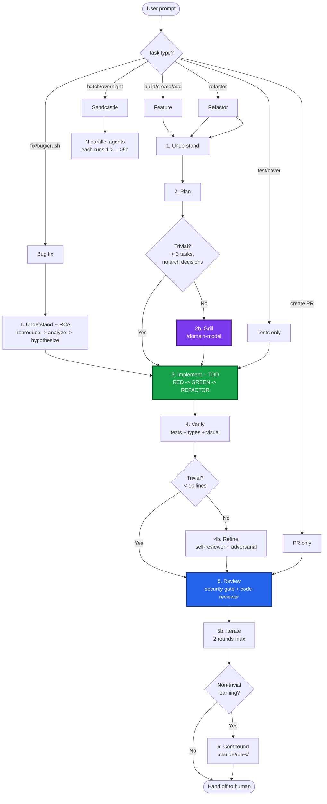
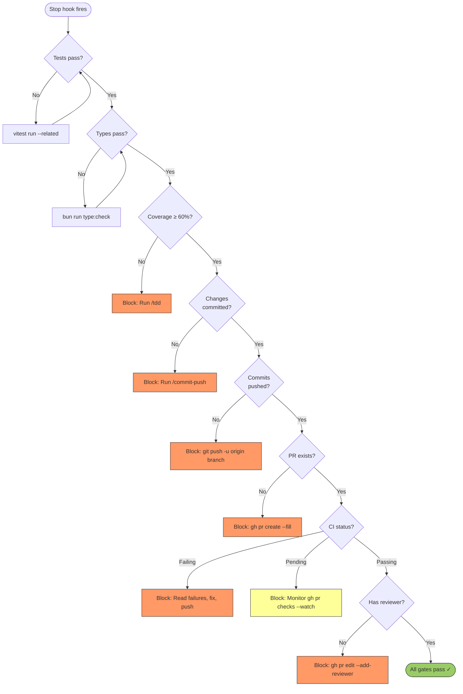

# Development Lifecycle Reference

## Phase Flowchart



## Phase 1: Understand

### New Feature
1. Read code, docs, recent git history
2. Clarifying Qs -- one at time
3. Propose 2-3 approaches w/ trade-offs
4. UI: HTML mockup -> `agent-browser screenshot --annotate` -> iterate
5. Challenge approach (edge cases, failure modes)
6. User approval before proceed

### Parallel Research Agents

Background agents:
- Alt libraries/patterns
- Prior art · conventions scan
- Edge cases · failure modes
- Open issues · dep gotchas

Concurrent w/ user discussion. Feeds approach selection.

### Monitor Tool

Stream long-running process output realtime. React immediate, never block.

- **CI**: `Monitor: gh pr checks <number> --watch`
- **Dev server**: `Monitor: bun run dev`
- **Test watcher**: `Monitor: vitest --watch`
- **Containers**: `Monitor: docker logs -f <container>`
- **Build**: `Monitor: bun run build`

Start Monitor, do other work, react when actionable.

### Refactor-First Gate

Mixed-pattern area? Check:
- [ ] Multiple patterns same concern?
- [ ] Incomplete migration?
- [ ] Conflicting AI instructions?

Any true -> refactor first, separate PR. Mixed codebases = lower AI output quality.

### Bug Fix (4-Phase RCA)

**Iron law: no fixes w/o root cause.**

1. **Reproduce** -- FULL error, failing test
2. **Analyze** -- working examples, trace data upstream
3. **Hypothesize** -- "X root cause because Y." One at time.
4. **Fix at source** -- where data originates, not where crashes. Defense-in-depth: entry point · business logic · env guards.

## Phase 2: Plan

### Scope Clarity

Scope ambiguous or conflict:

1. **Surface assumptions:**
   ```
   ASSUMPTIONS:
   1. [assumption]
   2. [assumption]
   -> Correct now or I proceed.
   ```
2. **Stop on confusion.** Name conflict, present tradeoff, wait.
3. **Reframe to success criteria.** "Goal = [measurable outcome]. Correct?"
4. **Flag uncertainty.** `[CONFIDENCE: LOW -- reason]`

### Naive-First Design

Dumbest solution that works. Justify every addition:

1. **Problem** -- one paragraph. What, why now.
2. **Constraints** -- time, team, compat.
3. **Non-goals** -- excluded.
4. **Simplest viable** -- boring solution.
5. **Where naive falls short** -- demonstrated gaps only.
6. **For each addition** -- what gap, complexity, why simpler insufficient.

### Self-Adversarial Review

Pre-plan review:

| Dimension | Question |
|---|---|
| Simplicity | Fewer moving parts? "Why didn't you just..."? |
| Bundle/perf | Bundle size, render perf, initial load? |
| Accessibility | Keyboard nav, screen readers, WCAG? |
| Maintainability | Extendable in 6 months without author? |
| DX | API intuitive? Misuse risk? |
| Scope creep | Anything unsolicited? |
| Alternatives | One simpler rejected design and why. |

### Plan Checklist

- [ ] Every task: exact paths, exact code, expected output
- [ ] No TBD, no "similar to Task N", no "add error handling"
- [ ] Bite-sized (2-5 min/task)
- [ ] Test step per impl step
- [ ] Self-review: spec coverage, placeholder scan, type consistency

### Rapid Prototyping (UI)

Competitive prototyping over upfront spec:

1. 2-3 constraint sets
2. One agent per set parallel (`claude-sonnet-4-6`)
3. Each = working prototype
4. Review w/ user: `agent-browser screenshot` each
5. Pick winner, plan from prototype

**When**: UI where right approach unclear til running. Skip pure logic/API/data.

### Stacked PRs

5+ tasks:

1. Group by boundary (data -> logic -> UI -> tests)
2. Each group = one PR
3. First PR -> base. Subsequent -> prior PR branch
4. Merge bottom-up

Small PRs = 2-3x faster review, higher feedback quality.

## Phase 2b: Grill

**Mandatory gate plan->impl.**

Post-plan, auto-`/domain-model`:

1. Plan summary
2. Challenge vs existing domain (CONTEXT.md, ADRs)
3. Sharpen terminology -- ambiguous/overloaded terms
4. Challenge assumptions, surface tradeoffs, find gaps
5. Resolve decision branches
6. Update CONTEXT.md + ADRs inline
7. Update plan w/ changed decisions
8. Confirm: "Plan solid, proceed"

### Why

Code = byproduct of understanding. Can't defend decisions under pressure -> cognitive debt. Grilling builds human mental model *before* LLM writes. Inline CONTEXT.md/ADR = institutional memory.

### Skip Conditions

Mandatory unless ALL true:
- [ ] Bug fix, single root cause
- [ ] <3 tasks
- [ ] No arch decisions

Skipping: "Grill skipped -- trivial bug fix, no arch decisions."

## Phase 3: Implement (TDD)

### Iron Law
**No prod code w/o failing test first.**

### Cycle
1. RED -- minimal failing test, verify correct fail
2. GREEN -- minimal code to pass
3. **TEST INTEGRITY** -- test/assertion count not decreased. Dropped -> agent weakened tests. Reject, redo RED.
4. REFACTOR -- clean, stay green

### Test Quality
- `userEvent.setup()` not `fireEvent`
- `getByRole` for a11y
- No `setTimeout`/`waitForTimeout` -- `await waitFor(() => expect(...))`
- `--detectAsyncLeaks` after

### Test Deletion Guard

Agents delete/simplify tests to pass ("unpredictable genie"):

1. **Count check**: pre-GREEN note `test()` + `expect()` count. Post-GREEN verify >=.
2. **Diff review**: test deletions in GREEN -> manual flag.
3. **Pre-commit hook**: reject commits reducing assertions w/o `// intentional: [reason]`.

### Classification
| Suffix | Purpose |
|---|---|
| `.test.ts` | Unit -- pure logic, no DOM |
| `.test.tsx` | Integration -- renders components |
| `e2e/*.spec.ts` | E2E -- Playwright |

## Phase 3b: Edge-Case Hardening (Optional)

Post-verify, dispatch agent:

1. Identify changed functions/components
2. Generate tests: boundary · empty/null · concurrent · error paths · large inputs
3. Run -- keep passing, investigate failing
4. Add passing to suite

**When**: new public APIs, security-sensitive, complex branching. Skip trivial.

## Phase 4b: Refine (Self-Review Loop)

**Goal**: catch quality gaps · missing tests · simplification while context fresh.

### When

- **Always** features + bug fixes
- **Skip**: trivial (<10 lines, no logic) · test-only · docs-only

### Process

1. Dispatch `self-reviewer` on session diff
2. Diff >50 lines OR auth/security -> also `adversarial-reviewer` parallel
3. SubagentStop validates JSON, writes to session dir
4. Process by priority:

| Priority | Action |
|----------|--------|
| P0 (blocks merge) | Fix immediately, re-run tests |
| P1 (should fix) | Fix, re-run tests |
| P2 `safe_auto` | Apply automatically |
| P2 `gated_auto` | Show to user, apply on confirmation |
| P2 `manual` | Report, let user decide |
| P3 / `advisory` | Skip -- log for Phase 6 |

5. Commit fixes: `refactor(scope): self-review fixes`, re-verify
6. **Max 2 rounds** -- P0/P1 persist -> proceed to Review, flag

### Findings Format

Reviewers output JSON per `agents/findings-schema.md`:
- `severity`: P0-P3 | `autofix_class`: `safe_auto | gated_auto | manual | advisory`
- `pre_existing`: true = dirty baseline (never blocks merge) | `confidence`: 0.0-1.0

### SubagentStart Context

Auto-inject: session-touched files · dirty baseline · branch/PR context · `agents/findings-schema.md` pointer.

### SubagentStop Validation

Matcher `self-reviewer|code-reviewer|adversarial-reviewer`:
- Validate JSON vs schema · block/retry if malformed
- Write `/tmp/hook-session-$SESSION_ID/review-findings.json` · log `review-summary.log`

### Agents

| Agent | Focus | When |
|-------|-------|------|
| `self-reviewer` | Testing gaps · simplification · CI readiness | Always in 4b |
| `adversarial-reviewer` | Failure scenarios · boundary/race conditions | Diff >50 lines or auth/security |
| `code-reviewer` | Spec compliance · code quality (fresh-eyes) | Phase 5 |

## Phase 4: Review

### Security Gate

**Hard gate pre-PR.** AI code statistically higher security issue rate.

SAST/SCA on changed files:
- [ ] No new critical/high findings
- [ ] No CVE deps
- [ ] No `eval()` · `innerHTML` · `dangerouslySetInnerHTML` unsanitized
- [ ] No hardcoded secrets/tokens/keys
- [ ] No SQL/command injection

**Tools**: `eslint-plugin-security` | `semgrep` | `bun audit` | `trivy fs .`

**Block PR** if new critical/high.

Dispatch `code-reviewer` fresh-eyes:

### Stage 1: Spec Compliance
- [ ] Requirements addressed | No scope creep | Breaking changes documented | Edge cases handled

### Stage 2: Code Quality (priority)
1. **Security** -- no eval · innerHTML · secrets
2. **Type safety** -- no `as any` · `@ts-ignore`
3. **Error handling** -- async w/ error paths
4. **A11y** -- kbd nav · aria-labels · semantic HTML
5. **Testing** -- behavior · edge cases
6. **DRY** -- no dupes
7. **Perf** -- no re-render waste · heavy deps lazy

### Status Codes
- **APPROVED** -- all pass | **CONCERNS** -- minor, address, proceed | **NEEDS_CHANGES** -- fix, re-review

### Cross-Model (Optional)
```
/codex:adversarial-review
```
Require: `bun install -g @openai/codex` + OpenAI key.
Install: `/plugin marketplace add openai/codex-plugin-cc` -> `/plugin install codex@openai-codex` -> `/codex:setup`

### Ship
```bash
gh pr create --title "type(scope): description" --body "..."
gh pr comment <URL> --body "@claude review"
```

## Phase 5b: Iterate

### Monitor CI, Don't Block

Monitor CI background. Continue work, react on fail/pass.

```
Monitor: gh pr checks <pr-number> --watch
```

**Round 1:**
1. Push + monitor. Continue other work.
2. CI green -> dispatch `code-reviewer`.
3. `/resolve-pr-feedback` -- triage · fix · reply · push.
4. Monitor again.

**Round 2 (verification):**
1. `code-reviewer` verifies Round 1 fixes.
2. `/resolve-pr-feedback` remaining findings.
3. New issues -> fix · push · monitor. No 3rd round.

**Hand off to human:**
1. Final PR comment: changes · findings · how addressed · test coverage.
2. `gh pr edit <number> --add-reviewer <username>`
3. **Stop.** Don't poll for approval.

**Human requests changes later** (new session):
1. `/resolve-pr-feedback` -- fetch · triage · fix · reply · push
2. Monitor CI
3. One `code-reviewer` + `/resolve-pr-feedback`
4. Re-request review, stop

**Exit:**
- **Normal**: CI green + 2 reviews + human requested -> stop
- **Re-entry**: human changes -> new session, one round, stop
- **Never**: poll for approval or >2 rounds/session

### Deploy Monitoring (Post-Merge)

```
Monitor: gh run watch
```

Deploy fail -> diagnose, open follow-up PR.

## Lifecycle Stop Gates

`lifecycle-stop.sh` cascade. Each gate blocks til satisfied.



## Hard Rules

- No manual user test. Use agent-browser · playwright · runner.
- No skip Phase 1.
- No prod code w/o failing test first.

## Commit Discipline

**Commit when green.** One concern/commit. `type(scope): what changed`.
Issues: `Closes #42` or `Fixes PROJ-123` in body.

## Phase 6: Compound

Post non-trivial tasks, codify lessons as path-scoped rules:

```markdown
<!-- .claude/rules/protobuf-v2-timestamp.md -->
---
paths:
  - "**/*_pb*"
  - "**/gen/**"
---
Protobuf v2 Timestamp fields: use timestampFromDate() from @bufbuild/protobuf/wkt.
Never construct as { seconds, nanos } -- causes JSON serialization failure.
```

Rules auto-load ONLY on matching files.

**Compound when:**
- Bug fix reveals non-obvious pattern
- Recurring migration gotcha
- Team-agreed API contract/convention

**Don't compound:**
- One-off fix
- Already hook-covered
- Generic knowledge Claude has

### Regression Evals for AI Bugs

Bug traced to AI code:

1. **Classify**: null handling · edge case · API misuse · security gap
2. **Regression test**: catches class, not instance
3. **Add CI**: runs every commit
4. **Track**: same class 3+ times -> `.claude/rules/` entry

Project-specific quality signal. Generic linting catches generic; regression evals catch *your* AI failure modes.

## Cross-Model Review

`/codex:rescue` available -> auto-dispatch plan for 2nd opinion. Bug triage: GitHub issue comments as cross-model channel.

## Subagents

| Agent | Role | When |
|---|---|---|
| `self-reviewer` | Testing gaps · simplification · CI readiness | Phase 4b |
| `adversarial-reviewer` | Failure scenarios · boundary/race conditions | Phase 4b (conditional) |
| `code-reviewer` | Fresh-eyes spec compliance + quality | Phase 5 |
| `verifier` | Tests + visual verification via browser | Phase 4 |

## Parallelization Guide

| Task | Parallelize? | How | Sweet spot |
|---|---|---|---|
| Codebase-wide migration | Yes | `/batch` | 5-30 agents per file/module |
| Security scan | Yes | `/batch` or Sandcastle | 3-5 agents per directory |
| Multiple UI designs | Yes | Spawn 3 agents, different constraints | 3 max |
| Independent features | Yes | Sandcastle (AFK) | 3-5 agents per issue |
| Test generation | Yes | Sandcastle or `/batch` | One per module |
| Bug fix | No | Sequential reasoning needed | 1 agent |
| Code review | 2 agents | spec+quality + Codex | 2-3 reviewers |

`/batch` = migrations · Sandcastle = AFK · 3 agents = design competition.

| Complexity | Model |
|---|---|
| Simple (rename, move) | `claude-haiku-4-5` |
| Standard (feature) | `claude-sonnet-4-6` |
| Complex (architecture) | `claude-opus-4-7` |

Don't parallelize: bug fixes · hypothesis testing. Don't >5 agents on overlapping files.