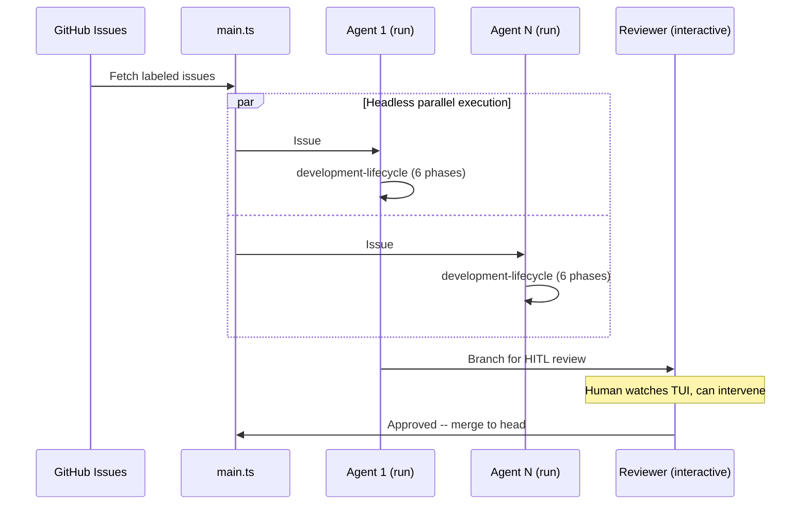

# Setup Sandcastle

[Sandcastle](https://github.com/mattpocock/sandcastle) orchestrate agents in sandboxes with branch strategies. Two modes:

- **`run()`** -- headless (`--print`), stream-JSON parsed. CI, batch, overnight.
- **`interactive()`** -- full TUI passthrough (stdin/stdout/stderr). Human watch + intervene. HITL review, pair-review, local dev.

Both modes: hooks fire inside each session. Dev lifecycle enforced regardless of launch method.

**Capabilities:** task picking (GitHub issues -> one agent per issue), parallel N agents in isolated sandboxes, HITL review with full TUI, `noSandbox()` for git worktrees only, hooks in each session, branch strategies (head, merge-to-head, branch).



## Steps

### 1. Install
```bash
bun add -D @ai-hero/sandcastle && bunx sandcastle init
```

### 2. Configure `.sandcastle/.env`
```
ANTHROPIC_API_KEY=sk-ant-...
```

### 3. Choose launch mode

| Scenario | Mode | Sandbox |
|---|---|---|
| CI/batch/overnight | `run()` | `docker()` |
| Parallel 5+ issues | `run()` | `docker()` |
| Local dev quick review | `interactive()` | `noSandbox()` |
| Pair-review with human | `interactive()` | `docker()` or `noSandbox()` |
| Single interactive session | `interactive()` | `noSandbox()` |

### 4. Orchestration Script
See [REFERENCE.md](REFERENCE.md) for templates: headless batch, HITL review, mixed pipelines.

### 5. Run
```bash
bunx tsx .sandcastle/main.ts
```

Each agent: read issue -> development-lifecycle -> hooks enforce patterns -> commit -> review -> merge.

See [REFERENCE.md](REFERENCE.md) for templates + prompt patterns.